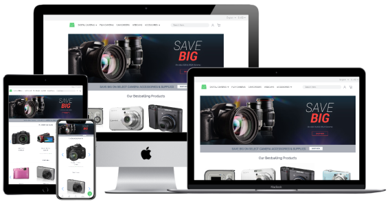

# Spartacus Capybara

This is an implementation [Capybara theme for Vue Storefront](https://github.com/DivanteLtd/vsf-capybara) but in [SAP Spartacus Storefront](https://github.com/SAP/spartacus). You can treat this repository as a sample Spartacus implementation or a starter code. Feel free to look around and get inspired.

🔨  **Current status: Developer's preview**

Most of the work has been done already. However, we are still developing and enhancing it.

## 🚀 See it in action

[Here you can try it out](https://spartacus-demo.web.app/)

## ✨  Features

Our implementation supports all Spartacus B2C Storefront features including: Cart, Checkout, Wishlist, Search, Product Page, Category Page, etc.

We also provide a style guide here [spartacus-demo.web.app/style-guide](https://spartacus-demo.web.app/style-guide).

## 👥  Maintainers

If you need any support contact us:

- Marek Ukleja [@sprajt](https://github.com/sprajt)
- Adam Kaczmarek [@bja1011](https://github.com/bja1011)
- Michał Dydo [@dydome](https://github.com/dydome)
- Mateusz Ostafil [@mateuszo](https://github.com/mateuszo)

You can also find us on [Spartacus Slack workspace](https://join.slack.com/t/spartacus-storefront/shared_invite/enQtNDM1OTI3OTMwNjU5LTg1NGVjZmFkZjQzODc1MzFhMjc3OTZmMzIzYzg0YjMwODJiY2YxYjA5MTE5NjVmN2E5NjMxNjEzMGNlMDRjMjU).

## ☑️  Requirements

This project is based on [Spartacus Storefront](https://github.com/SAP/spartacus) so the requirements are the same and can be found [here](https://github.com/SAP/spartacus#requirements).

## 🔌  Installation

1. `yarn install`
2. `yarn start`
3. open [localhost:4200](http://localhost:4200)

## 📓  Notes for developers

We are using a public SAP Commerce Cloud (CCv2) instance as a backend - the same which is used by [Spartacus Public instance](https://stackblitz.com/edit/angular-b9ayx6?file=src%2Fapp%2Fapp.component.html). Because of this we had to provide some static CMS configuration. In production environment this configuration could be migrated to an impex.
